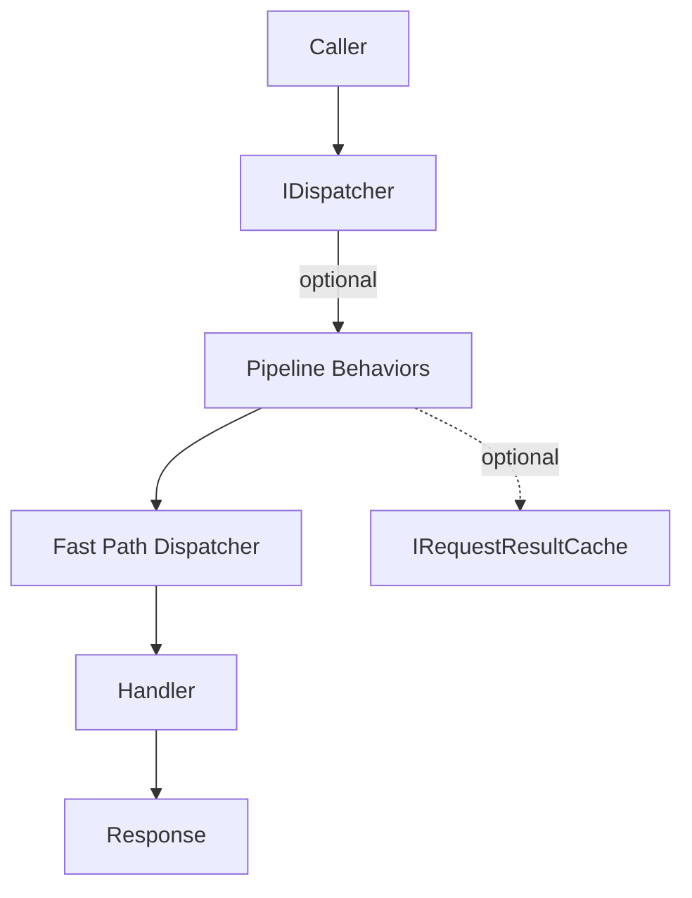

# Capybaras MiniCqrs

A minimal, fast-path CQRS dispatcher for .NET. MiniCqrs focuses on zero-reflection handler execution, DI-first design, and opt-in extras (pipeline behaviors, caching, source-generated extensions). This repository contains the core libraries that can be published to NuGet (e.g., `Cap.MiniCqrs`, `Cap.MiniCqrs.Caching.Memory`).

## Getting Started

Install the dispatcher package (and the optional caching package) into your project:

```bash
dotnet add package Cap.MiniCqrs --version 0.1.0
dotnet add package Cap.MiniCqrs.Caching.Memory --version 0.1.0
```

Register the dispatcher and discover handlers via DI, then inject `IDispatcher` (or `ICachedDispatcher` when using cache keys):

```csharp
using Cap.MiniCqrs;
using Cap.MiniCqrs.Caching;
using Cap.MiniCqrs.Caching.Memory;
using Cap.MiniCqrs.Dispatching;
using Cap.MiniCqrs.Registry;

var services = new ServiceCollection();
services.AddMiniCqrs()
        .AddMiniCqrsHandlersFrom(typeof(Program).Assembly);

services.AddScoped<IDispatcher, Dispatcher>();
services.AddScoped<ICachedDispatcher, StrictCachedDispatcher>();
services.AddSingleton<IRequestResultCache, MemoryRequestResultCache>();
```

Once registered, inject the dispatcher anywhere DI reaches and call:

```csharp
var result = await dispatcher.Send<CreateUserResult, CreateUserCommand>(command, ct);
var stats = await dispatcher.Query<UserCountResponse, UserCountQuery>(query, ct);
```

## Goals
- Zero-reflection dispatch path for commands and queries.
- Tiny API surface (no magic base classes or runtime type tables).
- Friendly to AOT/trimming scenarios.
- Optional ergonomic add-ons that do not compromise performance (caching/idempotency decorators, pipeline behaviors, source-generated extensions).
- OSS-ready: docs, samples, tests, CI, SemVer, MIT license.

## Fast-Path Dispatcher

```csharp
namespace Cap.MiniCqrs;

public interface IDispatcher
{
    Task<TResponse> Send<TResponse, TCommand>(TCommand command, CancellationToken ct = default)
        where TResponse : notnull
        where TCommand : ICommand<TResponse>;

    Task<TResponse> Query<TResponse, TQuery>(TQuery query, CancellationToken ct = default)
        where TResponse : notnull
        where TQuery : IQuery<TResponse>;
}
```

```csharp
using Cap.MiniCqrs;
using Cap.MiniCqrs.Dispatching;

services.AddScoped<IDispatcher, Dispatcher>();
services.AddScoped<ICommandHandler<CreateUserCommand, CreateUserResult>, CreateUserHandler>();

var result = await dispatcher.Send<CreateUserResult, CreateUserCommand>(new CreateUserCommand(request), ct);
```

Handlers are resolved via DI as closed generics and invoked directly—no reflection or dynamic invocation occurs during dispatch.

## Architecture



### Components
- `Cap.MiniCqrs`: `ICommand<T>`, `IQuery<T>`, handler interfaces, `IDispatcher`.
- `Cap.MiniCqrs.Dispatching`: `Dispatcher` fast-path implementation.
- `Cap.MiniCqrs.Caching`: `ICacheKeyProvider`, `IRequestResultCache`, `CachedDispatcher`.
- `Cap.MiniCqrs.Caching.Memory`: optional HybridCache-backed result cache implementation.
- Planned namespaces: `Cap.MiniCqrs.Pipeline`, `Cap.MiniCqrs.SourceGen`.

## Optional Enhancements
- **Pipeline Behaviors** – wrap handler execution for logging, validation, timing, or idempotency.
- **Caching / Idempotency** – requests implementing `ICacheKeyProvider` can be cached or deduplicated via `IRequestResultCache` using either the fast-path `StrictCachedDispatcher` (compile-time constraint) or the decorator `CachedDispatcher` (wraps any `IDispatcher`).
- **Source-Generated Extensions** – Roslyn generator emits strongly-typed `dispatcher.Send(command)` extensions (no runtime reflection, best ergonomics).

### Caching Usage
#### Primary: Dispatcher + StrictCachedDispatcher
```csharp
using Cap.MiniCqrs;
using Cap.MiniCqrs.Caching;
using Cap.MiniCqrs.Caching.Memory;
using Cap.MiniCqrs.Dispatching;

// Request provides a cache key (e.g., idempotency token)
public sealed record FinishGameCommand(long UserId, long MessageId)
    : ICommand<FinishGameResponse>, ICacheKeyProvider
{
    public string CacheKey => $"finish:{UserId}:{MessageId}";
}

// DI (services is IServiceCollection)
services.AddHybridCache();
builder.Services.AddSingleton<IRequestResultCache>(sp =>
    new MemoryRequestResultCache(sp.GetRequiredService<HybridCache>(), TimeSpan.FromMinutes(10)));
builder.Services.AddScoped<IDispatcher, Dispatcher>();
builder.Services.AddScoped<ICachedDispatcher, StrictCachedDispatcher>();

// Usage
var dispatcher = provider.GetRequiredService<ICachedDispatcher>();
var response = await dispatcher.Send<FinishGameResponse, FinishGameCommand>(
    new FinishGameCommand(userId, messageId),
    cancellationToken);
```

Need to revoke cache entries? Call `IRequestResultCache.InvalidateAsync(key)` for a single idempotency key or `InvalidateByTagsAsync(tags)` to purge groups (e.g., all cache for a user).

> Need custom lifetimes? Call `IRequestResultCache.GetOrAddAsync` with a `TimeSpan ttl` and optional cache `tags` to override defaults per request.

#### Optional: CachedDispatcher Decorator
If you need to wrap an existing dispatcher (without constraining request types at compile time), use the decorator:

```csharp
services.AddHybridCache();
services.AddSingleton<IRequestResultCache, MemoryRequestResultCache>();
services.AddScoped<Dispatcher>();
services.AddScoped<IDispatcher>(sp =>
{
    var inner = sp.GetRequiredService<Dispatcher>();
    var cache = sp.GetRequiredService<IRequestResultCache>();
    return new CachedDispatcher(inner, cache);
});

var dispatcher = provider.GetRequiredService<IDispatcher>();
var response = await dispatcher.Send<FinishGameResponse, FinishGameCommand>(
    new FinishGameCommand(userId, messageId),
    cancellationToken);
```

## Roadmap
1. **v0.1.0** – core dispatcher, DI extensions, README, tests, sample.
2. **v0.2.x** – pipeline behaviors + memory caching package.
3. **v0.3.x** – source generator (extensions or invoker tables).
4. **v1.0.0** – documentation polish, AOT guidance, benchmarks, community governance.

## Repository Layout
```
Cap.MiniCqrs.sln
src/
  Cap.MiniCqrs/
    ICommand.cs
    IQuery.cs
    ICommandHandler.cs
    IQueryHandler.cs
    IDispatcher.cs
    Dispatching/Dispatcher.cs
    Caching/
      ICacheKeyProvider.cs
      IRequestResultCache.cs
      CachedDispatcher.cs
      ICachedDispatcher.cs
      StrictCachedDispatcher.cs
  Cap.MiniCqrs.Caching.Memory/
    MemoryRequestResultCache.cs
samples/
  DispatcherSample/
tests/
  Cap.MiniCqrs.Tests/
```

### Samples
- `samples/DispatcherSample` – minimal console app showing how to wire the dispatcher via `AddMiniCqrs()`/`AddMiniCqrsHandlersFrom(...)` and send/query handlers. Run with `dotnet run --project samples/DispatcherSample`.
- `samples/SliceSlotWebApi` – trimmed-down “slot” Web API that uses vertical-slice folders (`Features/*`) plus the `GameStateStore` in-memory aggregate. It exposes `/api/game/init`, `/api/game/spin`, and `/api/game/collect`. Run via `dotnet run --project samples/SliceSlotWebApi` and exercise the endpoints with the bundled `SliceSlotWebApi.http` file (REST Client / HTTP REPL friendly).

### Tests
- `tests/Cap.MiniCqrs.Tests` – xUnit coverage for send/query dispatching and the DI extensions. Execute via `dotnet test`.

## License
MIT (to be added before publishing the NuGet packages).

Made with 🍃 by Capybaras.
